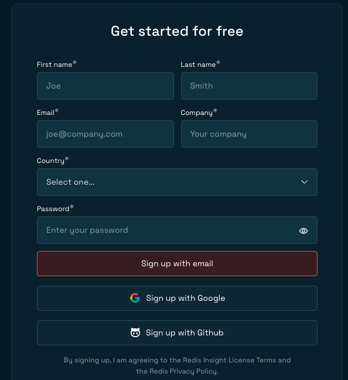
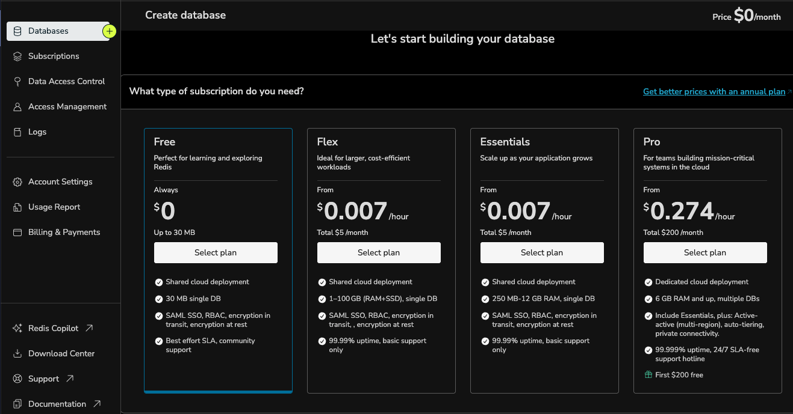
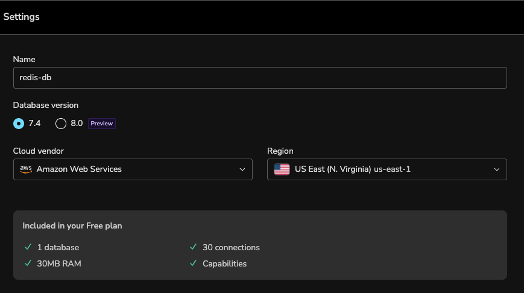
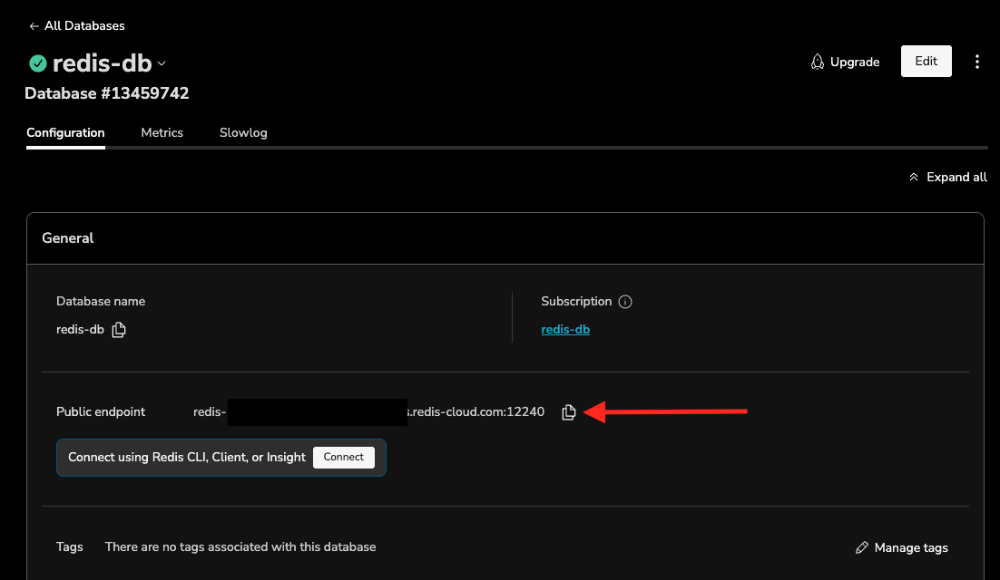
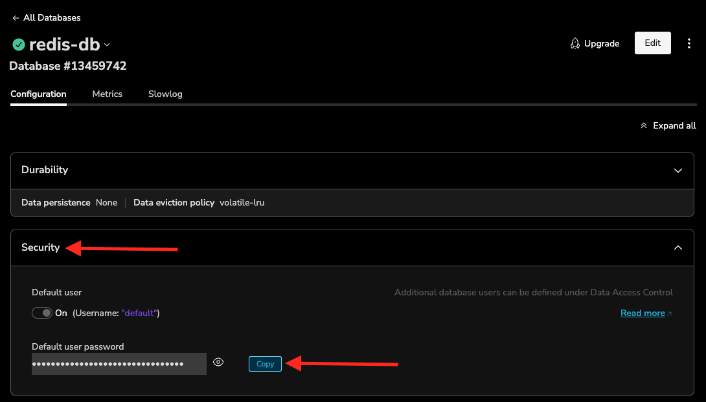
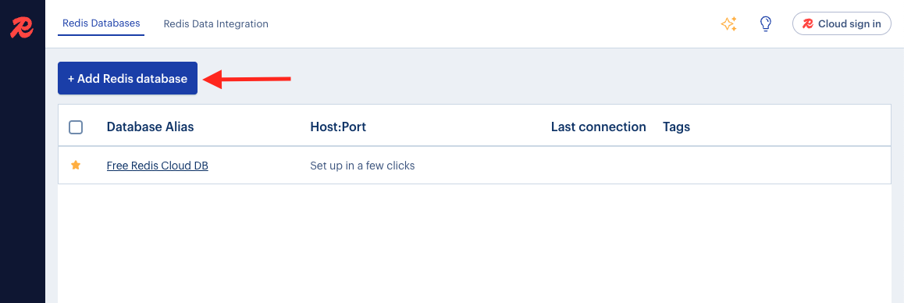
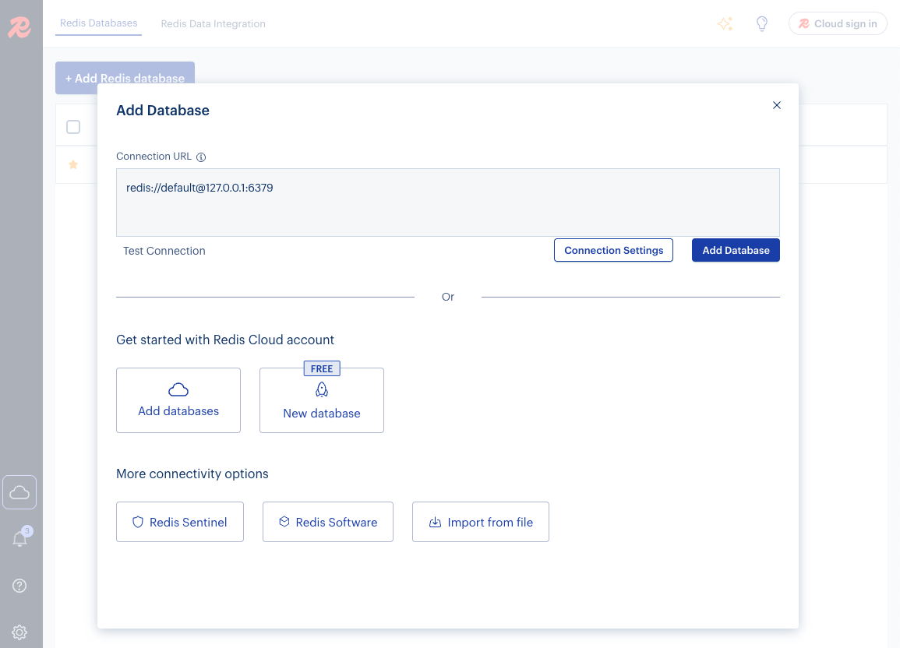
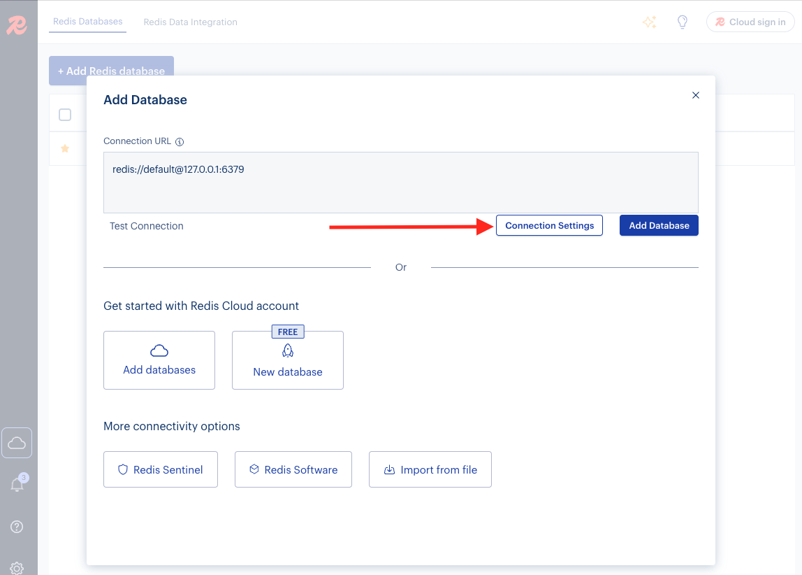
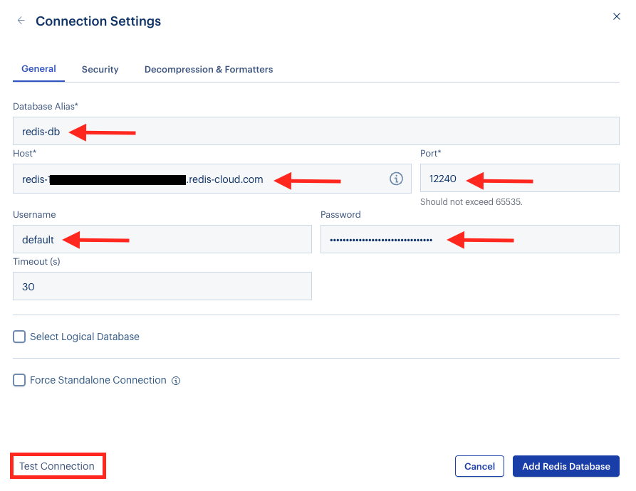
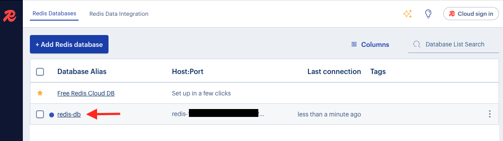

# Redis Workshop Lab: Getting Started with Redis Cloud + RedisInsight

Welcome to the Redis Workshop! This lab will walk you through:

- Setting up a **free Redis Cloud database**
- Retrieving connection details
- Connecting it to **RedisInsight**

---

## 🧩 Prerequisites

- A web browser
- Access to https://redis.io/try-free/
- RedisInsight app installed (https://redis.com/redis-enterprise/redis-insight/)

---

## 🚀 Step 1: Sign Up for Redis Cloud

1. Go to 👉 [https://redis.io/try-free/](https://redis.io/try-free/)

2. Sign up with your email.
3. Check your email to activate your account.
4. Once activated, you’ll be taken to the **Create Database** page.

---

## 🏗️ Step 2: Create a Free Redis Database

1. Select the **Free** option.
2. Scroll down to configure:

| Field         | Example Value          | Notes                                     |
|---------------|------------------------|-------------------------------------------|
| Name          | `redis-db`             | Name your Redis database                  |
| Cloud Vendor  | `Amazon Web Services`  | Choose any listed cloud provider          |
| Region        | `us-east-1`            | Pick a region close to your application   |

> 💡 Free plan includes 30MB of Redis memory

Once done, this is how the database settings would look like,

3. Click **Create Database**.

You’ll now be taken to your database details page.

---

## 🧠 Key Configuration Fields

| Field                | Meaning                                           |
|---------------------|---------------------------------------------------|
| **Vendor**           | Cloud provider hosting the database               |
| **Region**           | Geographic location of the Redis instance         |
| **Public Endpoint**  | Hostname + port to connect to Redis               |
| **Redis Version**    | Engine version                                    |
| **Advanced Modules** | Additional Redis capabilities (Search, JSON, etc) |
| **Dataset Size**     | Max memory (e.g., 30MB in free tier)              |
| **Durability**       | AOF/RDB support                                   |
| **Eviction Policy**  | Key eviction behavior on memory limit             |

---

## 🔍 Step 3: Get Connection Details

To connect to your Redis Cloud Database, you need below connection details 
- Public endpoint
- Username
- Password

Lets gather this information from your Redis Cloud Database configuration console.

In your Redis Cloud Database details page, in the “General” section, copy the “Public endpoint”. 

On your Redis Cloud Database configuration page, scroll down and expand the “Security” section and click the copy button next to the “Default user password” box to copy the “default” user’s password (Please note - the “default” user and its password is automatically created when you create your Redis Cloud Database).

At this point, you should have below configuration details for your Redis Cloud Database,
- **Public endpoint**
- **Username**
- **Password**

You will need these details in the following steps.

## 🔗 Step 4: Connect Using RedisInsight

1. Open **RedisInsight**
2. Click **+ Add Redis Database**

It will pop up the “Add Database” console as below,

3. Click **Connection Settings**

4. Fill in the following:

| Field            | Value                          |
|------------------|--------------------------------|
| Database Alias   | `redis-db`                     |
| Host             | `<Paste your public endpoint>` |
| Port             | (auto-filled)                  |
| Username         | `default`                      |
| Password         | `<Paste password copied earlier>` |

Below is how it should look like once you have filled the above information in the connection fields,

5. Click **Test Connection**
   - ✅ Should say: “Connection is successful”
6. Click **Add Redis Database**

---

## 🎉 You're Done!

You should now see your Redis Cloud database listed in RedisInsight!

Click on your Database Alias ("redis-db" from the list and it will take you to your Redis Database Workbench)

Happy exploring! 🚀

---

## 🧰 Resources

- [Redis Cloud Docs](https://docs.redis.com/latest/rc/)
- [RedisInsight Download](https://redis.com/redis-enterprise/redis-insight/)
